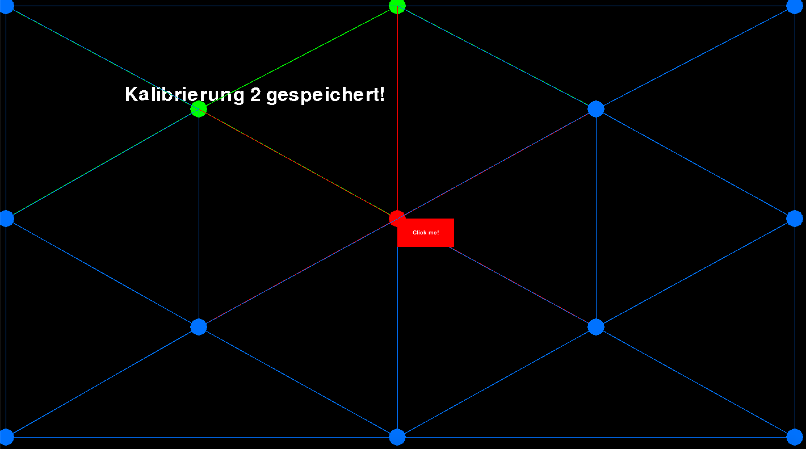

# REM-EYE-WS1920
Remote eye tracking program used as team project for University of Tübingen
## Introduction
This program uses HAAR cascading to detect facial features via your webcam. The detected features are compared to previously saved calibration points and get compared via HOG features to approximate your gazing point and project in to the screen.
## How to use 
1. You need python3.7 and installed requirements from requirements.txt (install with `pip install -r requirements.txt`)
2. Run main.py
3. Place your head about 20cm away from your webcam and start calibration, make sure lightning is good and facial features are getting detected. 3 calibration pictures are getting taken per calibration point. If no features are detected, your camera LED will blink fast until features are detected, then it will blink slowly (about 1s intervall).
4. After calibration is done, gazing approximation will start automatically
## Images

tbd